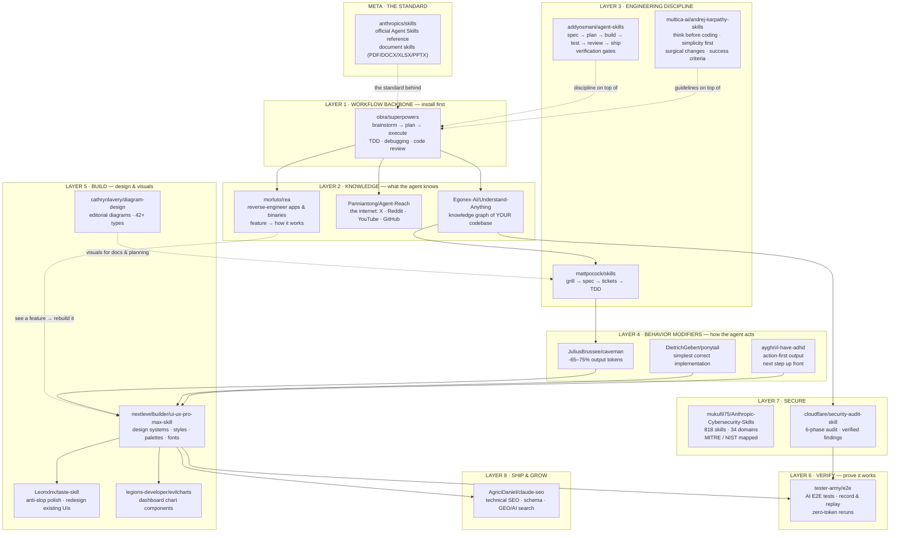

# Aaron's Skill Stack

> My every-machine starter kit for coding agents — Cursor, Claude Code, Codex, Copilot, Windsurf, and friends.
> Clone it, run the installer, and every new agent inherits the same workflow, discipline, taste, and verification layer.

Star counts are approximate as of Oct 2026 and move fast on trending repos — treat them as order-of-magnitude.

---

## Contents

- [Quick reference](#quick-reference)
- [Architecture — where each skill sits](#architecture--where-each-skill-sits)
- [The stack — 19 skills](#the-stack--19-skills)
- [Also worth knowing](#also-worth-knowing)
- [Install everything at once](#install-everything-at-once)
- [Push this to GitHub](#push-this-to-github)

---

## Quick reference

| # | Skill | What it gives you | Layer |
|---|-------|-------------------|-------|
| 1 | [Superpowers](https://github.com/obra/superpowers) | brainstorm → plan → execute, TDD, debugging, code review | Workflow |
| 2 | [Matt Pocock's Skills](https://github.com/mattpocock/skills) | Grill ideas, specs, tickets, TDD from a real engineer's setup | Discipline |
| 3 | [Addy Osmani's Agent Skills](https://github.com/addyosmani/agent-skills) | spec → plan → build → test → review → ship with verification gates | Discipline |
| 4 | [Caveman](https://github.com/JuliusBrussee/caveman) | ~65–75% fewer output tokens, zero accuracy loss | Behavior |
| 5 | [Ponytail](https://github.com/DietrichGebert/ponytail) | Simplest correct implementation, ~54% less code | Behavior |
| 6 | [Agent-Reach](https://github.com/Panniantong/Agent-Reach) | Internet access: X, Reddit, YouTube, GitHub — no paid APIs | Knowledge |
| 7 | [Understand-Anything](https://github.com/Egonex-AI/Understand-Anything) | Interactive knowledge graph of your codebase | Knowledge |
| 8 | [UI/UX Pro Max](https://github.com/nextlevelbuilder/ui-ux-pro-max-skill) | 79 UI styles, 192 palettes, design-system generator | Design |
| 9 | [EvilCharts](https://github.com/legions-developer/evilcharts) | Beautiful animated chart components for dashboards | Design |
| 10 | [Taste Skill](https://github.com/Leonxlnx/taste-skill) | Anti-slop frontend polish; redesign existing UIs | Design |
| 11 | [Diagram Design](https://github.com/cathrynlavery/diagram-design) | Editorial-quality diagrams: architecture, ER, sequence, 42+ types | Design |
| 12 | [Karpathy Skills](https://github.com/multica-ai/andrej-karpathy-skills) | Think-first, simplicity-first, surgical-change coding guidelines | Behavior |
| 13 | [I Have ADHD](https://github.com/ayghri/i-have-adhd) | Action-first, no-fluff output: next step up front, every time | Behavior |
| 14 | [Anthropic Cybersecurity Skills](https://github.com/mukul975/Anthropic-Cybersecurity-Skills) | 818 security skills across 34 domains, mapped to MITRE/NIST | Security |
| 15 | [Cloudflare Security Audit](https://github.com/cloudflare/security-audit-skill) | 6-phase security audit workflow with verified findings | Security |
| 16 | [Claude SEO](https://github.com/AgriciDaniel/claude-seo) | 26 SEO sub-skills: technical SEO, schema, GEO/AI-search, audits | Ship & grow |
| 17 | [Anthropic Skills (official)](https://github.com/anthropics/skills) | The Agent Skills standard reference + document skills (PDF/DOCX/…) | Meta |
| 18 | [TesterArmy E2E](https://github.com/tester-army/e2e) | AI-driven E2E tests; record once, replay with zero tokens | Verify |
| 19 | [REA](https://github.com/morluto/rea) | Reverse-engineer any app or binary: see a feature → rebuild it | Knowledge |

---

## Architecture — where each skill sits



**How to read it:** the agent *plans* with Layer 1, *understands* your code, the web, and any app with Layer 2, follows *engineering discipline* in Layer 3, writes *terse, minimal, action-oriented* code via Layer 4, builds *designed* UIs and visuals in Layer 5, *proves it works* in Layer 6, *secures it* in Layer 7, and *ships it to be found* in Layer 8. Install in layer order — each layer assumes the one above it.

---

## The stack — 19 skills

### 1. Superpowers — the workflow backbone

🔗 **https://github.com/obra/superpowers** · ~large community · MIT

**What it is.** A core library of 20+ skills plus `/brainstorm`, `/write-plan`, and `/execute-plan` commands. It forces the agent to follow a process before responding: brainstorm before coding, write a plan before executing, do test-driven development (red → green → refactor), debug systematically (4-phase root-cause analysis), get a code review, and verify a fix actually works before claiming it's done.

**How it helps.** Without it, every agent improvises its own process and you get a different quality of work every session. With it, every agent follows the same battle-tested workflow. It's the single highest-leverage install on this list.

**Where it's useful.** Any non-trivial task — features, refactors, bug fixes, anything spanning more than a couple of files.

**Install** (Claude Code):
```
/plugin marketplace add obra/superpowers-marketplace
/plugin install superpowers@superpowers-marketplace
```
Other agents: `npx skills@latest add obra/superpowers -g`

**Example.**
> You: "Add user authentication to the API."
> Agent (with Superpowers): doesn't write code yet. Runs `/brainstorm`, asks how users sign in, what the session strategy is, which routes need protection — *then* writes a plan, *then* executes it, and verifies the login flow works before saying "done."

---

### 2. Matt Pocock's Skills — engineering judgment

🔗 **https://github.com/mattpocock/skills** · ~242k stars · MIT

**What it is.** "Skills for Real Engineers. Straight from my .agents directory." The actual everyday workflow of Matt Pocock (Total TypeScript / AI Hero): `grill-with-docs` (interrogate the idea before building), `to-prd` / `to-spec` / `to-tickets` (idea → spec → sliced tickets), `tdd`, `diagnosing-bugs`, `code-review`, plus shared context conventions (`CONTEXT.md`, ADRs).

**How it helps.** It makes the agent do the engineering *thinking*, not just the typing. Decisions get made up front and the agent is held to them during the build — no more "the agent built the wrong thing really fast."

**Where it's useful.** Starting features, shaping vague ideas into buildable plans, and anywhere you want the agent to challenge your requirements before coding.

**Install:** `npx skills@latest add mattpocock/skills -g`

**Example.**
> You: "Build me an authenticated API endpoint."
> Agent (with `grill-with-docs`): asks ~35 questions first — Bearer token vs JSON body? Rate limit at exactly 1,000 requests/day or soft? What does the error response look like? — the decisions *you* hadn't consciously made until the machine forced you to. Then it builds exactly what you agreed on.

> ⚠️ Overlap: this collection is also vendored inside [alirezarezvani/claude-skills](#also-worth-knowing). Install one, not both.

---

### 3. Addy Osmani's Agent Skills — the gated lifecycle

🔗 **https://github.com/addyosmani/agent-skills** · ~60–90k stars · MIT

**What it is.** ~20 structured skills with 7 slash commands mapping the full dev lifecycle — `/spec`, `/plan`, `/build`, `/test`, `/review`, `/code-simplify`, `/ship` — plus specialist personas (code reviewer, test engineer, security auditor). Two signature ideas: **anti-rationalization tables** (each skill lists the excuses agents use to skip steps, with documented rebuttals) and **verification gates** (the agent must show evidence — e.g. passing tests — before a phase counts as done).

**How it helps.** Agents love to skip steps and declare victory. This skill is engineered specifically to stop that. If Superpowers is the process and Pocock is the judgment, Osmani is the quality gate at every phase.

**Where it's useful.** Production code, team repos, anything where "it works on my machine" isn't good enough.

**Install:** `npx skills@latest add addyosmani/agent-skills -g`

**Example.**
> Agent finishes `/build` and wants to move on. The verification gate stops it: "Show me the passing tests." No green tests, no `/ship`. The agent runs the suite, fixes the two failures it was hoping you'd miss, and *then* ships.

---

### 4. Caveman — the token saver

🔗 **https://github.com/JuliusBrussee/caveman** · ~100k stars · Apache-2.0

**What it is.** *"Why use many token when few token do trick."* A skill that makes the agent drop filler, articles, and hedging while keeping every technical detail exact. Six intensity levels (`lite` → `full` → `ultra` → `wenyan`), plus `/caveman-commit`, `/caveman-review`, `/caveman-stats` (tracks your USD savings), and a local proxy that compresses inputs too.

**How it helps.** You pay per token and read every word the agent writes. ~65–75% output-token savings with no accuracy loss — the author's study even found brevity *improved* accuracy. Pure cost and signal-to-noise win.

**Where it's useful.** Everywhere, always. Especially long sessions where context window is precious.

**Install:** `npx skills@latest add JuliusBrussee/caveman -g`

**Example.**
> Before: "I've successfully implemented the requested feature. The changes I made include modifying three files. First, I updated the configuration file to add the new setting…"
> After (caveman): "Done. 3 files changed: `config.ts` (+12), `auth.ts` (+48), `auth.test.ts` (+31). All 14 tests pass."

---

### 5. Ponytail — the minimalist

🔗 **https://github.com/DietrichGebert/ponytail** · ~150k stars · MIT

**What it is.** The "laziest senior dev" skill. A seven-rung ladder the agent checks before writing code, steering it toward the simplest correct implementation. Tagline: *"He says nothing. He writes one line. It works."* Author-benchmarked: ~54% fewer lines of code, ~22% fewer tokens, ~27% faster across real feature tasks.

**How it helps.** Agents default to over-engineering — new dependencies, abstractions, design patterns nobody asked for. Ponytail is the counterweight. Combined with Caveman, your agent writes less *and* says less.

**Where it's useful.** Feature work, prototypes, and any codebase where you value simplicity over cleverness.

**Install:** `npx skills@latest add DietrichGebert/ponytail -g`

**Example.**
> You: "I need a date picker on the signup form."
> Agent without Ponytail: installs a date-picker library, adds 40KB to the bundle, wires up a theme adapter.
> Agent with Ponytail: ships `<input type="date">`. One line. Works on every browser. Done.

---

### 6. Agent-Reach — the agent's eyes

🔗 **https://github.com/Panniantong/Agent-Reach** · ~92k stars · MIT

**What it is.** A CLI capability layer giving any agent read/search access to the internet — X/Twitter, Reddit, YouTube, GitHub, Bilibili, XiaoHongShu, Facebook, Instagram, LinkedIn, RSS — with **zero paid APIs**. Each platform has ordered preferred + fallback backends, and `agent-reach doctor` diagnoses which route is currently live.

**How it helps.** Coding agents are blind to the living web: docs, threads, issues, video tutorials. This is their eyes. The multi-backend routing means when one scraper gets blocked, it fails over automatically with no action from you.

**Where it's useful.** Research tasks ("what's the current best auth library?"), debugging obscure errors, checking real-world opinions before choosing a dependency.

**Install:** `agent-reach install` (point the agent at the repo's `docs/install.md`; it handles the rest). Safety flags: `--dry-run`, `--system`.

**Example.**
> You: "Which React table library should I use in 2026?"
> Agent (with Agent-Reach): searches Reddit threads, GitHub issues, and recent X posts — not just its training data — and comes back with "TanStack Table, and here's what people complain about with the alternatives," citing actual discussions.

---

### 7. Understand-Anything — the codebase map

🔗 **https://github.com/Egonex-AI/Understand-Anything** · ~85k stars · MIT

**What it is.** Analyzes your project with a multi-agent pipeline and builds an **interactive knowledge graph** — every file, function, class, and dependency as explorable nodes. Ships a web dashboard, guided architectural tours, semantic search, diff impact analysis, and onboarding-guide generation. Philosophy: "Graphs that teach > graphs that impress."

**How it helps.** Every new repo (or new agent session on an old repo) starts with the agent guessing where things live. This replaces guessing with a map — the agent asks the graph instead of grepping blindly.

**Where it's useful.** Onboarding onto unfamiliar codebases, large refactors ("what breaks if I change this?"), and handing context to teammates via the shareable dashboard.

**Install** (Claude Code):
```
/plugin marketplace add Egonex-AI/Understand-Anything
/plugin install understand-anything
```
Other agents: one-line `curl …/install.sh | bash -s <platform>` (see repo README). Note: the first `/understand` run on a large codebase is token-heavy; later runs are incremental.

**Example.**
> You (new repo, first session): `/understand`
> You: "Which parts handle auth?"
> Agent: opens the knowledge graph, traces `login()` → `session.ts` → the middleware chain, and shows you the full call path — instead of reading 200 files to answer.

---

### 8. UI/UX Pro Max — the taste layer

🔗 **https://github.com/nextlevelbuilder/ui-ux-pro-max-skill** · ~133k stars · MIT

**What it is.** Design intelligence for coding agents: **79 searchable UI styles, 192 industry-specific reasoning rules, 192 color palettes, 74 font pairings, 119 UX guidelines.** The v2 flagship is a Design System Generator that reasons over your product brief and emits a complete design system (pattern + style + colors + typography + effects + anti-patterns + pre-delivery checklist), persistable to `design-system/<project>/MASTER.md` for cross-session consistency.

**How it helps.** Agents write functional-but-ugly UIs by default. This is the taste layer — it makes agent-built interfaces look *designed* instead of *generated*. The most-starred repo on this list.

**Where it's useful.** Any UI the agent builds: landing pages, dashboards, marketing sites, app screens.

**Install:** `npm install -g ui-ux-pro-max-cli && uipro init --ai <your-agent>` (or `--ai all` for every agent). Requires Node.js + Python 3.

**Example.**
> You: "Build a landing page for a fitness app."
> Agent (with UI/UX Pro Max): generates a full design system first — style direction, palette, font pairing, spacing rules — saves it to `design-system/fitness-app/MASTER.md`, then builds every section against it. Next session, the agent reuses the same system. Consistent, not random.

---

### 9. EvilCharts — dashboard charts that don't look cheap

🔗 **https://github.com/legions-developer/evilcharts** · ~3k stars · MIT

**What it is.** An open-source chart component library built on shadcn + Recharts — handcrafted, animated bar/line/area/pie/radar components for React/Next.js dashboards. Ships `.claude/skills/` and `.agents/skills/` directories so agents can use it correctly out of the box.

**How it helps.** Dashboards are where agent-built UIs look cheapest, and charts are the hard part. Instead of hand-rolled SVGs, the agent pulls from a curated component source.

**Where it's useful.** Admin panels, analytics pages, any dashboard with data visualization.

**Install:** `npx skills@latest add legions-developer/evilcharts -g` for the agent skill; components install shadcn-style when building (see [evilcharts.com](https://evilcharts.com)).

**Example.**
> You: "Add a revenue chart to the admin dashboard."
> Agent (with EvilCharts): pulls an animated area chart component with gradient fill, tooltip, and responsive container — instead of spending 200 lines hand-rolling one that looks like a spreadsheet.

---

### 10. Taste Skill — the anti-slop frontend framework

🔗 **https://github.com/Leonxlnx/taste-skill** · ~93k stars · MIT

**What it is.** "The Anti-Slop Frontend Framework for AI Agents." Portable skills that upgrade AI-built interfaces with stronger layout, typography, motion, and spacing instead of generic-looking UIs. Ships variants: default `design-taste-frontend` (with VARIANCE / MOTION / DENSITY dials and GSAP skeletons), `gpt-taste` (stricter, GPT/Codex-oriented), `image-to-code` (image → analyze → code), `redesign-existing-projects` (audit-then-fix), style skills (soft / minimalist / brutalist), plus image-generation skills (website comps, mobile screens, brand kits).

**How it helps.** UI/UX Pro Max (#8) *generates* the design system; Taste Skill *polishes and fixes* — especially existing UIs that already look generic. Together they're the full design loop: system first, taste always.

**Where it's useful.** New frontends that need to not look AI-generated, and redesigns of existing projects that look dated.

**Install:** `npx skills@latest add Leonxlnx/taste-skill -g` — or a single skill: `npx skills@latest add Leonxlnx/taste-skill --skill "design-taste-frontend" -g`

**Example.**
> You: "This dashboard looks like every AI-generated dashboard. Fix it."
> Agent (with the redesign skill): audits the UI first — flags the flat hierarchy, default spacing, system font stack — then fixes layout, rhythm, typography, and motion. The repo ships rendered before/after examples of exactly this transformation.

---

### 11. Diagram Design — editorial diagrams on demand

🔗 **https://github.com/cathrynlavery/diagram-design** · ~43k stars · MIT

**What it is.** Editorial-quality diagram design for agents — **42+ diagram types**: architecture, sequence, ER, swimlane, Sankey, Wardley maps, kanban, user journeys, UML, database schemas, exploded axonometrics, and more. Output is self-contained HTML + SVG (no build step), three variants per type (minimal light, minimal dark, full editorial). It can match diagrams to your brand by reading your website, import from draw.io / Mermaid / Excalidraw and redraw them, and export PNG/SVG. Live gallery at cathrynlavery.github.io/diagram-design.

**How it helps.** Agents draw terrible diagrams by default — gray Mermaid boxes. This makes architecture docs, READMEs, and planning artifacts look *published*.

**Where it's useful.** Architecture docs, RFCs, onboarding docs, client presentations, any planning artifact with a diagram in it.

**Install** (Claude Code):
```
/plugin marketplace add cathrynlavery/diagram-design
/plugin install diagram-design@diagram-design
```
Other agents: `npx skills@latest add cathrynlavery/diagram-design -g` (Codex, Copilot, Pi, Kiro, OpenCode also have native plugin routes — see repo README).

**Example.**
> You: "Show me the current auth architecture, then what it looks like after we add SSO."
> Agent: renders both topologies side by side in editorial style, with an added / removed / changed / moved / rewired ledger — the skill's "architecture delta" mode.

---

### 12. Karpathy Skills — the four principles

🔗 **https://github.com/multica-ai/andrej-karpathy-skills** · ~217k stars · MIT

**What it is.** A single `CLAUDE.md` of guidelines distilled from Andrej Karpathy's observations on LLM coding pitfalls. Four principles: **Think Before Coding** (state assumptions, surface tradeoffs), **Simplicity First** (minimum code, no speculative abstractions), **Surgical Changes** (touch only what the task needs — don't "improve" adjacent code), **Goal-Driven Execution** (turn tasks into verifiable success criteria and loop until met). Also ships as a `karpathy-guidelines` skill with a Cursor project rule.

**How it helps.** It's the philosophy layer underneath the discipline skills — the *why* behind Ponytail's minimalism and Osmani's verification gates, in Karpathy's voice. Cheap to install (it's mostly one file), always on.

**Where it's useful.** Every coding session. Especially refactors, where the "don't touch adjacent code" rule saves you from scope creep.

**Install:** `npx skills@latest add multica-ai/andrej-karpathy-skills -g` — or per-project: `curl -o CLAUDE.md https://raw.githubusercontent.com/multica-ai/andrej-karpathy-skills/main/CLAUDE.md`

> ⚠️ The repo moved orgs (`forrestchang/` → `multica-ai/`); its README install commands may still reference the old name. Use the `multica-ai/` URLs above.

**Example.**
> You: "Add validation to the signup form."
> Agent without Karpathy: rewrites the form, adds a validation library, refactors three nearby components "while I'm here."
> Agent with Karpathy: states the success criteria first — "invalid emails rejected, tests prove it" — writes the tests, makes them pass, touches nothing else. Karpathy's line: *"Don't tell it what to do, give it success criteria and watch it go."*

---

### 13. I Have ADHD — action-first output

🔗 **https://github.com/ayghri/i-have-adhd** · ~54k stars · MIT

**What it is.** "A skill to stop your coding agent from burying the answer." Ten rules for ADHD-friendly output: lead with the next action, number multi-step tasks, end with one concrete next step, suppress tangents, restate state every turn, time estimates in minutes, make wins visible, matter-of-fact errors, cap lists at 5 items, no preamble/recap/closers.

**How it helps.** Caveman (#4) makes output *shorter*; this makes it *structured for action*. You never scroll past three paragraphs of throat-clearing to find the one command you need to run.

**Where it's useful.** Every interaction, but especially debugging sessions and multi-step tasks where losing the thread is easy.

**Install:** `npx skills@latest add ayghri/i-have-adhd -g` (also ships native plugins for Claude Code, Codex, Cursor, Gemini, OpenCode, and more — see repo's AGENTS.md).

**Example.**
> Before: "Great question! Let me think about this. Your auth flow has a few moving pieces…"
> After: "Run `npm install jsonwebtoken@latest`, then edit `src/auth.ts:42`.
> 1. Open `src/auth.ts` → replace `verifyToken` (lines 42–58) with the snippet below
> 2. Run `npm test -- auth.spec.ts`
> Next: paste the first failing line if any test fails."

---

### 14. Anthropic Cybersecurity Skills — the security library

🔗 **https://github.com/mukul975/Anthropic-Cybersecurity-Skills** · ~34k stars · Apache-2.0

**What it is.** The largest open-source cybersecurity skills library for AI agents — **~818 structured skills across 34 security domains** (cloud security, SOC ops, threat hunting, DFIR, malware analysis, red teaming, pentesting, AI security…), each mapped to the relevant of 6 frameworks: MITRE ATT&CK, NIST CSF 2.0, MITRE ATLAS, MITRE D3FEND, NIST AI RMF, and MITRE F3. (Community project — not affiliated with Anthropic, despite the name.) Offensive techniques are explicitly labeled authorized-and-lawful-use-only.

**How it helps.** Your stack had zero security coverage — the agent could ship an SQL injection with perfect TDD and a beautiful UI. This is the knowledge base that lets the agent *think* about security: threats, frameworks, and mitigations, on demand.

**Where it's useful.** Anything internet-facing: auth, APIs, cloud infra, handling user data. Also security reviews and learning.

**Install:** `npx skills@latest add mukul975/Anthropic-Cybersecurity-Skills -g`

**Example.**
> You: "Review this login handler for security issues."
> Agent (with the library): pulls the relevant skills — checks for injection, session handling, rate limiting — and cites the finding against the framework: "Missing rate limiting on `/login` → brute-force risk (ATT&CK T1110, NIST CSF PR.AC). Add a limiter."

---

### 15. Cloudflare Security Audit — the audit workflow

🔗 **https://github.com/cloudflare/security-audit-skill** · ~25k stars · MIT

**What it is.** A single-repo skill for **multi-phase security audits with independently verified, machine-readable findings**. Six phases: reconnaissance (architecture + coverage ledger) → coverage-led hunting (isolated hunter agents + coverage critics) → candidate validation (a *fresh* verifier tries to disprove each finding) → structured output (`confirmed` / `needs_validation` / `rejected` verdicts in `findings.json`) → independent record verification → target-neutral reporting. This is the skill that seeded Cloudflare's own vulnerability discovery harness.

**How it helps.** #14 is the security *knowledge*; this is the security *process*. The adversarial design — a separate verifier tries to kill every finding — is what keeps audits honest instead of producing 200 false positives.

**Where it's useful.** Pre-launch audits, reviewing unfamiliar codebases, periodic sweeps of anything handling auth, payments, or PII.

**Install:** `npx skills@latest add https://github.com/cloudflare/security-audit-skill --skill security-audit -g`

**Example.**
> You: "Security audit this codebase."
> Agent: runs the 6-phase workflow and writes `REPORT.md`, `FINDINGS-DETAIL.md`, and `NEEDS-VALIDATION.md` — every finding carrying a verdict. Design note from the repo: multiple runs are additive, and a single run finds roughly half of what repeated runs find in total — so run it more than once before launch.

---

### 16. Claude SEO — ship it to be found

🔗 **https://github.com/AgriciDaniel/claude-seo** · ~18k stars · MIT

**What it is.** A comprehensive SEO plugin: **26 sub-skills + 19 specialist sub-agents** covering technical SEO (Core Web Vitals, CrUX field data), E-E-A-T content analysis, Schema.org markup, AI-search/GEO optimization (citability scoring, `llms.txt`, agent readiness), backlinks, local SEO, e-commerce, international SEO, Google API integrations, and PDF/Excel reporting. 34 `/seo` commands, plus 9 optional extensions for live data.

**How it helps.** You can build the perfect site and nobody finds it. This is the growth layer — the agent audits, fixes, and optimizes for both Google *and* AI search (ChatGPT / Perplexity citations), which is where discovery is moving.

**Where it's useful.** Marketing sites, blogs, docs sites, e-commerce — anything with a URL you want traffic on.

**Install** (Claude Code — primary target):
```
/plugin marketplace add AgriciDaniel/claude-seo
/plugin install claude-seo@agricidaniel-claude-seo
```
Then run `/seo setup` (creates an isolated Python env + Playwright Chromium; `/seo doctor` checks readiness). Manual route: `git clone --depth 1 https://github.com/AgriciDaniel/claude-seo.git && bash claude-seo/install.sh`.

**Example.**
> You: `/seo audit https://example.com`
> Agent: fans out up to 17 specialist agents in parallel across the site — technical, content, schema, GEO — and returns a prioritized action plan. `/seo geo https://example.com` then optimizes specifically for AI Overviews.

---

### 17. Anthropic Skills — the official standard

🔗 **https://github.com/anthropics/skills** · ~180k stars · Apache-2.0 (document skills are source-available)

**What it is.** Anthropic's official public Agent Skills repo — the **reference implementation of the Agent Skills standard** itself. Example skills across Creative & Design, Development & Technical, and Enterprise & Communication — including the actual document-creation skills that power Claude's DOCX / PDF / PPTX / XLSX abilities, shared as reference. Also ships the Agent Skills spec and a skill template.

**How it helps.** Two things: (1) it teaches the agent to *create documents* properly (reports, decks, spreadsheets — the stuff around the code), and (2) it's the spec every other skill on this list conforms to — useful when you write your own skills.

**Where it's useful.** Generating client deliverables (PDFs, slide decks, spreadsheets), and as the reference when authoring custom skills.

**Install** (Claude Code):
```
/plugin marketplace add anthropics/skills
/plugin install document-skills@anthropic-agent-skills
```
Other agents: `npx skills@latest add anthropics/skills -g` (reference value; document skills are Claude-native).

**Example.**
> You: "Turn this report into a PDF with our branding."
> Agent (with document-skills): uses the official PDF skill — proper layout, fonts, and structure — instead of dumping markdown into a converter and hoping.

---

### 18. TesterArmy E2E — proof it works

🔗 **https://github.com/tester-army/e2e** · ~4.6k stars · Apache-2.0

**What it is.** Next-generation E2E testing: describe a test goal in natural language and an AI agent drives the app (`agent.act('upgrade the workspace to the Pro plan')`), freely mixed with deterministic Playwright locators and assertions. The clever bit: once an agent step runs, its actions are **recorded and replayed with zero model calls** until the app changes — stable regressions cost no tokens.

**How it helps.** It's the verification layer's teeth — Layer 3 says "show evidence," this produces it. The record-and-replay design answers the "AI tests are too expensive to run in CI" objection. Complementary to #15: the audit *finds vulnerabilities*, E2E *proves flows work*.

**Where it's useful.** Critical user flows: signup, checkout, upgrades, onboarding — anything where "the unit tests pass" isn't the same as "the product works."

**Install** (per project, never global): `npx e2e init` — asks for engine (web/mobile) and model provider, writes config + an example test.

**Example.**
```ts
// One natural-language step, plus a hard assertion
await agent.act('upgrade the workspace to the Pro plan');
await expect(page.getByText('Pro plan active')).toBeVisible();
```
> First run: the agent drives the browser with model calls. Every run after: recorded actions replay deterministically — zero tokens — until the UI changes.

---

### 19. REA — reverse engineer anything

🔗 **https://github.com/morluto/rea** · ~10k stars · MIT

**What it is.** One MCP server for reverse engineering across binaries, applications, and runtime behavior. Point your agent at any app and it inspects native binaries (via Hopper or Ghidra), JavaScript/Electron apps, .NET assemblies, and websites — then explains how a feature works and builds a version for your project. Analysis runs locally, and every conclusion ships with the evidence and limitations behind it.

**How it helps.** It's Layer 2's investigation arm — Understand-Anything maps *your* codebase, REA maps *theirs*. It turns "this app has a feature I want" into an explained, evidence-backed implementation in your codebase. Setup registers REA with your agent and installs its guided investigation workflow.

**Where it's useful.** Rebuilding competitor features you can't read the source for, auditing third-party apps, debugging opaque native crashes, CTF-style binary analysis, or learning how a closed-source tool does something clever.

**Install** (global): `npx rea-agents setup` — interactive wizard; picks which agents get REA, shows the paths and changes before applying, and can optionally wire up Hopper or an existing Ghidra install for native analysis.

**Example.**
```md
This app's infinite-scroll feed is buttery smooth — figure out how they do it and build ours the same way.
```
> The agent inspects the app without its source, explains the mechanism with evidence, and builds a compatible version for your project.

---

## Also worth knowing

Not in the stack, but kept on the radar:

- **[alirezarezvani/claude-skills](https://github.com/alirezarezvani/claude-skills)** (~28k stars, MIT) — a mega-library of ~380+ skills across 20 domains: engineering, product, marketing, finance, compliance, even C-level advisor personas. Already vendors Matt Pocock's skills. If you want *everything* including non-coding skills, install this **instead of** #2 — never alongside it.
- **[nidhinjs/prompt-master](https://github.com/nidhinjs/prompt-master)** (~14k stars, MIT) — a skill that writes optimized, token-frugal prompts for 30+ AI tools (Claude, ChatGPT, Codex, Midjourney, Sora…). Handy if you prompt other tools a lot; not a coding-workflow skill, which is why it sits outside the stack.
- **[darwintechlab/openjev](https://github.com/darwintechlab/openjev)** (brand new, MIT) — an Opencode plugin that replaces LLM judgment calls with deterministic typed decisions (`jev_choice`, `jev_noul`, …). Interesting infrastructure idea, but days old and unproven — flagged experimental, revisit in a few months.

> **Open item:** the original list had a **"4"** I couldn't match to any repo — likely a numbering artifact from a "top 10" post. Send the source and I'll slot the right skill in.

---

## Install everything at once

The agent-executable sequence lives in [`INSTALL.md`](INSTALL.md); the script is [`scripts/install.sh`](scripts/install.sh):

```bash
./scripts/install.sh --agent claude   # or: cursor | codex | copilot | generic
./scripts/install.sh --agent claude --dry-run   # preview first on a new machine
```

Install order is deliberate: **standard → workflow → knowledge → discipline → behavior → design → verify → secure → ship**. `tester-army/e2e` installs per-project — the script prints the command but never runs it globally.

## Push this to GitHub

```bash
git remote add origin https://github.com/<you>/aarons-skill-stack.git
git branch -M main
git push -u origin main
```
